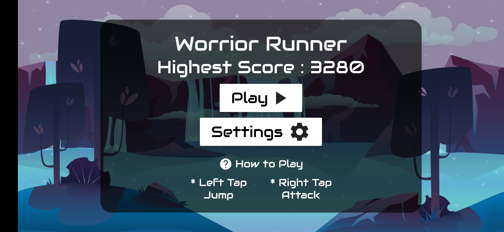
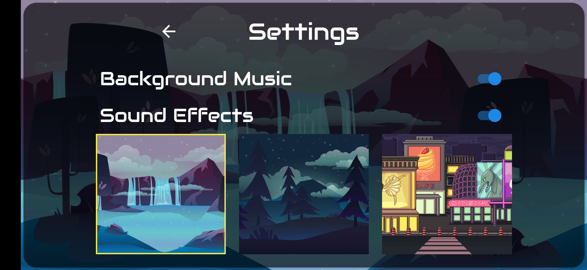
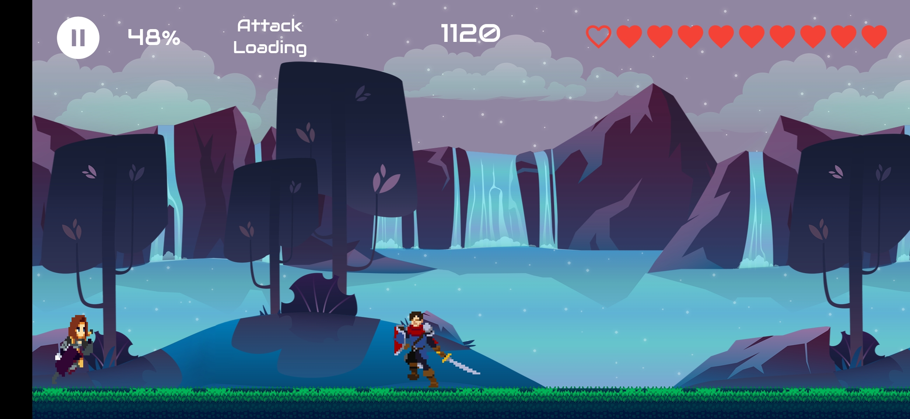
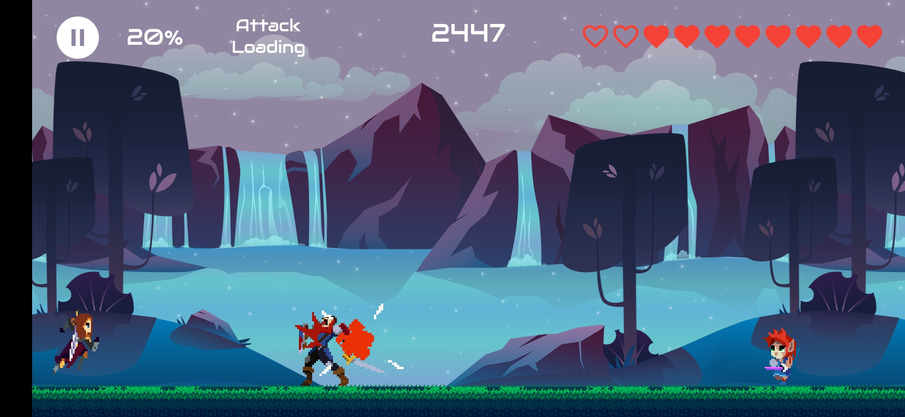
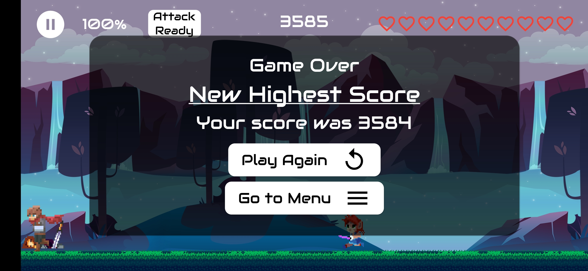

Warrior Runner - Game made with Flutter 
-------------  
    
#### Demo and Screenshot

  
   
  
	
  

-------------
##### Flutter Version Used : 1.22.4
##### flame: 0.29.3
##### hive: 1.5.0-pre
-------------
#### Learing Resources:
-  [Create a Mobile Game with Flutter and Flame – Beginner Tutorial](https://jap.alekhin.io/create-mobile-game-flutter-flame-beginner-tutorial)  
-  [2D Casual Mobile Game Tutorial – Step by Step with Flame and Flutter (Part 1 of 5)](https://jap.alekhin.io/2d-casual-mobile-game-tutorial-flame-flutter-part-1)
- [Spacescape - 2D Flutter game using Flame engine | DevKage](https://www.youtube.com/watch?v=fjNx0otqF-k&list=PLiZZKL9HLmWPL0URlq9WLng1A_g1LDuxx)
- [Dino Run - 2D Flutter game using Flame engine | DevKage](https://www.youtube.com/watch?v=txDjL4bxF4M&list=PLiZZKL9HLmWOmQgYxWHuOHOWsUUlhCCOY)
-------------  
### Assets Credit
- [Player Character](https://clembod.itch.io/warrior-free-animation-set?download)
- Enemies:
	- [Skeleton](https://jesse-m.itch.io/skeleton-pack) 
	- [Gino](https://szadiart.itch.io/animated-character-pack)
	- [Knight](https://sventhole.itch.io/hero-knight)
	- [Adventurer](https://rvros.itch.io/animated-pixel-hero)
	- [Bat](https://pixelfrog-assets.itch.io/pixel-adventure-2)
- [Fireball and Explosion](https://luizmelo.itch.io/fire-worm)
- [Ground is cut from here](https://jesse-m.itch.io/jungle-pack)
- Backgrounds:
	- [Water Fall Background and Forest Background](https://craftpix.net/freebies/free-horizontal-2d-game-backgrounds/)
	- [City Background](https://craftpix.net/freebies/free-pixel-art-street-2d-backgrounds/)
- Font : [Audiowide](https://fonts.google.com/specimen/Audiowide)
- Audio Files:
	- [Background Music](https://www.chosic.com/download-audio/?t=25860&tag=Games)
	- Attack,jump and attack sounds from this [pack](https://opengameart.org/content/female-rpg-voice-starter-pack)
	- [Explosion Sound](https://opengameart.org/content/rumbleexplosion)
